# 📚 Sumário

- [📌 Sobre o Projeto](#-sobre-o-projeto)
- [🚀 Getting Started](#-getting-started)
  - [⚙️ Pré-requisitos](#️-pré-requisitos)
  - [📥 Clonando o Repositório](#-clonando-o-repositório)
  - [🔧 Configuração do Backend](#-configuração-do-backend)
  - [🔐 Variáveis de Ambiente](#-variáveis-de-ambiente)
- [🔄 Fluxo da Aplicação](#-fluxo-da-aplicação)
- [🏗 Arquitetura da Aplicação](#-arquitetura-da-aplicação)
- [🛠 Tecnologias Utilizadas](#-tecnologias-utilizadas)
- [🧪 Estratégia de Testes](#-estratégia-de-testes)
- [⚙️ Decisões Técnicas](#️-decisões-técnicas)
- [📁 Estrutura do Projeto](#-estrutura-do-projeto)
- [🧐 Exemplos de Uso](#-exemplos-de-uso)
- [🚧 Melhorias Futuras](#-melhorias-futuras)
- [🔮 Pontos de Observação](#-pontos-de-observação)

---

# 📌 Sobre o Projeto

O **Olympus API** é uma API REST desenvolvida para servir como base backend de futuras aplicações voltadas ao gerenciamento e acompanhamento de exercícios físicos.

A plataforma permite:

- cadastro e autenticação de usuários
- gerenciamento de atividades físicas
- categorização por tipos de exercício
- histórico de atividades realizadas

A proposta é construir uma arquitetura escalável, segura e preparada para evolução futura.

---

# 🚀 Getting Started

## ⚙️ Pré-requisitos

- Git
- Python (≥ 3.10)
- pip
- MySQL
- Docker para gerenciar o celery

---

## 📥 Clonando o Repositório

```bash
git clone https://github.com/Jorgemiguelaviles/API-Olympus2.0.git
cd API-Olympus2.0/backend
```

---

## 🔧 Configuração do Backend

### Criar ambiente virtual

```bash
python -m venv .venv
```

### Ativar ambiente

**Linux/Mac**

```bash
source .venv/bin/activate
```

**Windows**

```bash
.venv\Scripts\activate
```

### Instalar dependências

```bash
pip install -r requirements.txt
```

### Gerar chaves

```bash
python "security\generate_keys.py"
```

com isso você ira grar um par de chaves sendo uma publica e uma privada, a publica pode vir servir para seu futuro frontend enquanto a privada serve exclusivamente para o seu backend, aonde você ir fazer o apontamento da mesma em suas variaveis de ambiente


### Rodar servidor
inicia FastAPI
```bash
uvicorn src.main:app --reload
```

inicia celery
```bash
celery -A src.infraestructure.celery.celery_app worker --pool=solo --loglevel=info
```

inicia redis
```bash
docker run -d --name redis-olympus -p 6379:6379 redis
```

### Endpoints locais

API:

```bash
http://localhost:8000
```

Swagger:

```bash
http://localhost:8000/docs
```


Redis:

```bash
localhost:6379
```


---

## 🔐 Variáveis de Ambiente

Crie um `.env` com base no `.env.example`

```env
DB_USER=
DB_PASSWORD=
DB_HOST=
DB_PORT=
DB_NAME=
API_KEY_GEMINI=
PRIVATE_KEY_PATH=
PUBLIC_KEY_PATH=
```

---

# 🔄 Fluxo da Aplicação

A API gerencia:

- autenticação de usuários
- cadastro de atividades físicas
- associação de atividades por categoria/tag
- registro de atividades executadas
- consulta de histórico
- gerenciamento de usuários
- gerenciamento de tags

---

# 🏗 Arquitetura da Aplicação

O projeto utiliza **Layered Architecture**.

## Camadas

1. Presentation
2. Application
3. Domain
4. Infrastructure
5. Testing

Essa separação permite:

- baixo acoplamento
- alta manutenibilidade
- facilidade para testes
- escalabilidade

---

# 🛠 Tecnologias Utilizadas

## Backend

- FastAPI
- Python
- Pydantic
- SQLAlchemy
- JWT
- MySQL
- Pytest

---

# 🧪 Estratégia de Testes

## Objetivos

- evitar regressões
- validar regras de negócio
- garantir integridade da API

## Cobertura esperada

- ≥ 90%

## Tipos de testes

- testes unitários
- testes de integração
- validação de endpoints

## Comando para testar testes automatizados

```env
pytest --cov=src --cov-report=term-missing
```

---

# ⚙️ Decisões Técnicas

## FastAPI

Escolhido por:

- alta performance
- documentação automática
- tipagem forte
- excelente integração com Pydantic

## MySQL

Escolhido por:

- confiabilidade
- consistência transacional
- ampla adoção no mercado

## JWT

Escolhido para:

- autenticação stateless
- segurança
- escalabilidade

---

# 📁 Estrutura do Projeto

```bash
API-Olympus/
├── backend/
├── database/
└── docs/
```

---

## Backend

```bash
backend/
├── .venv/
├── security/
├── .env
├── main.py
├── src/
│   ├── config/
│   ├── controllers/
│   ├── interfaces/
│   ├── middlewares/
│   ├── models/
│   ├── routes/
│   └── services/ 
└── tests/
```

---

## Responsabilidades

### `config/`

Configurações globais:

- banco de dados
- JWT (será adicionado na versão 2.0)

---

### `controllers/`

Controla o fluxo das requisições HTTP.

---

### `interfaces/`

construção dos schemas e da doc para sweggerAPI.

---

### `middlweares/`

interceptador para gerenciamento de tokenJWT.

---

### `models/`

Entidades e representação do banco.

---

### `services/`

Contém a lógica de negócio.

---

### `routes/`

Definição dos endpoints.

---

### `tests/`

Testes automatizados da aplicação.

---

# 🧐 Exemplos de Uso

### Cadastro
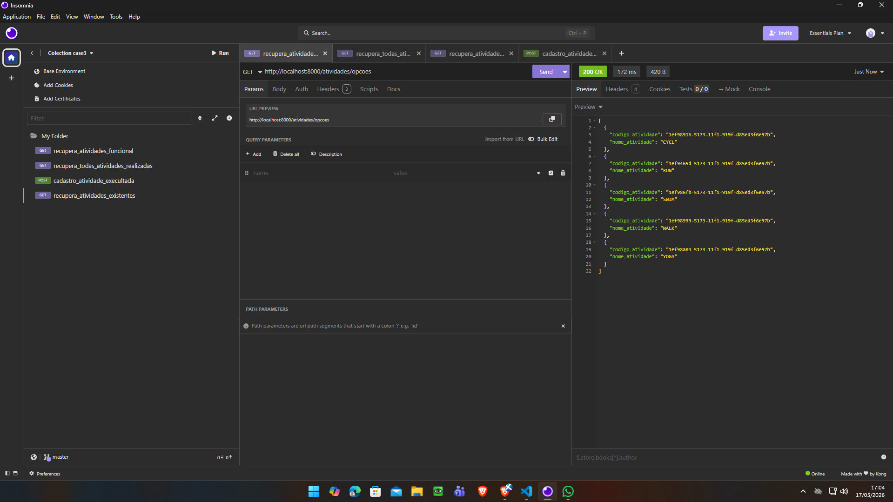

### login
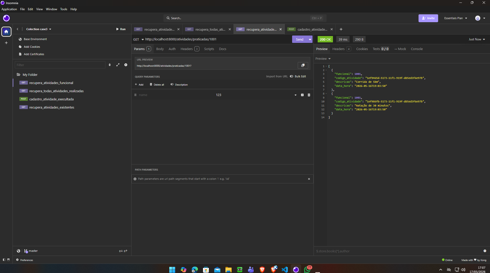

### historico de suas atividades mais chamada de analise de IA
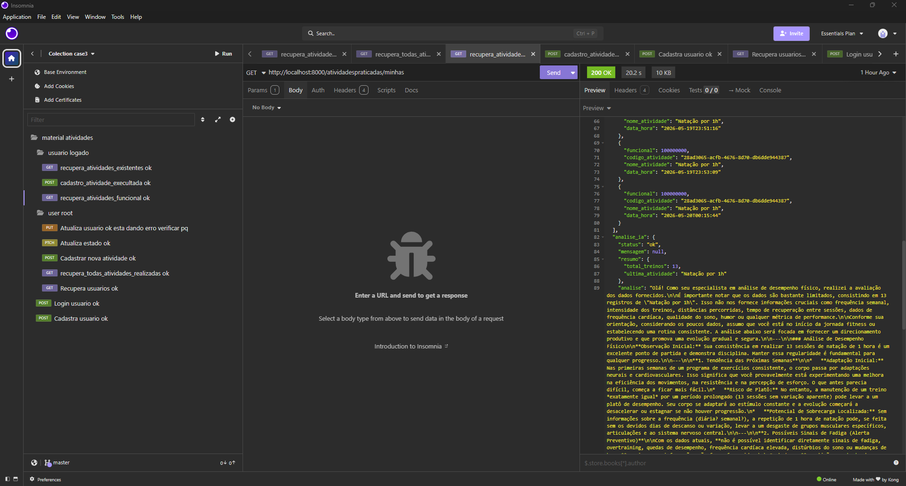

### atividades existentes
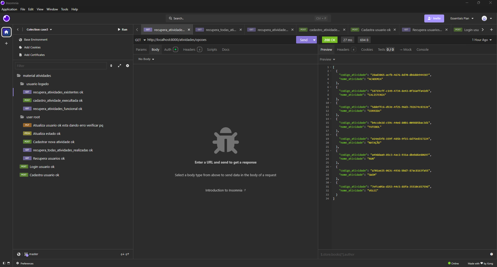

### cadastro de novas atividades
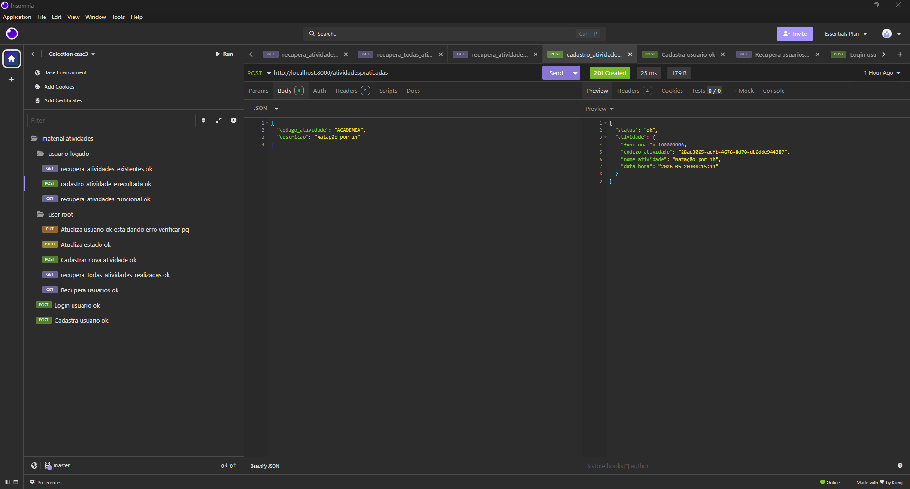

### lista de todos os usuários
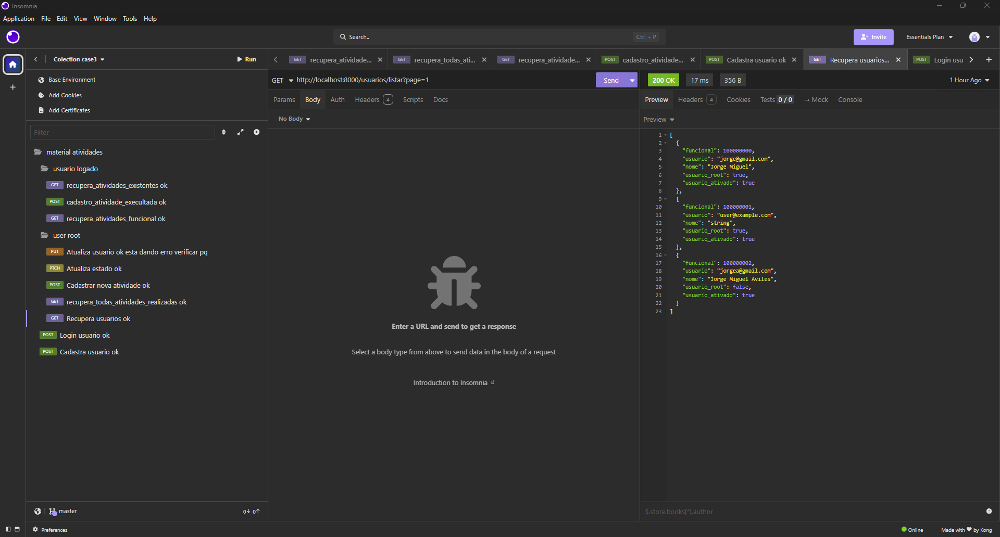

### lista de todas as atividades
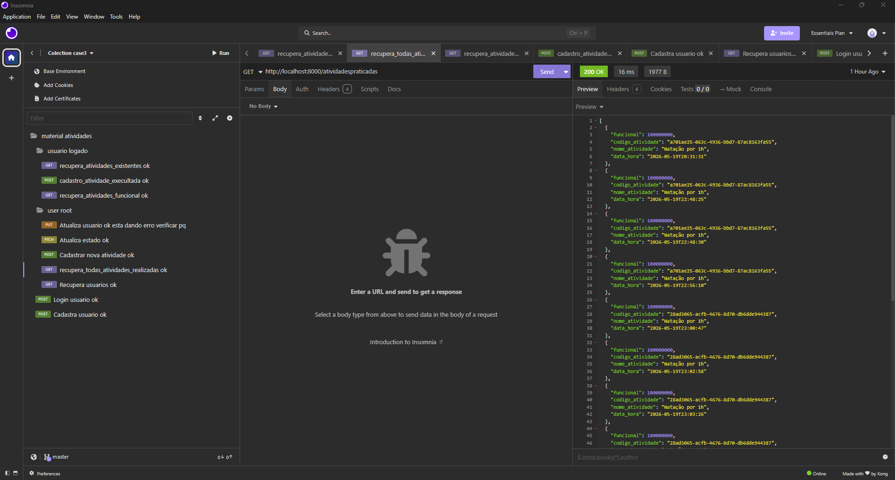

### cadastro de nova atividade
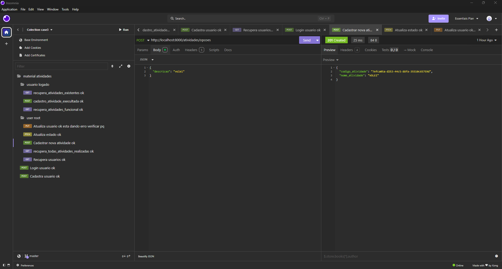

### atualização de estado sendo tanto cadastro ativado ou usuario root
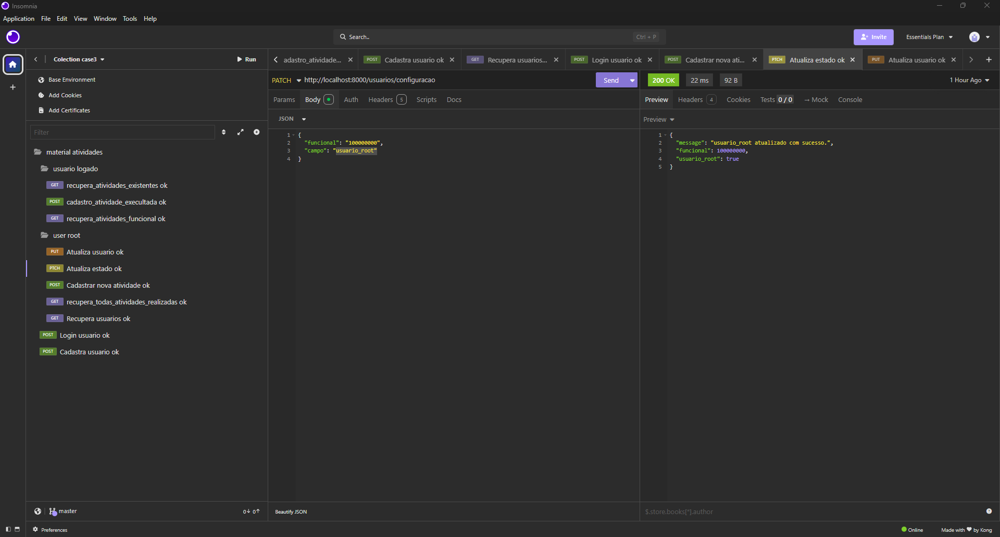

### atualização de informações do usuario
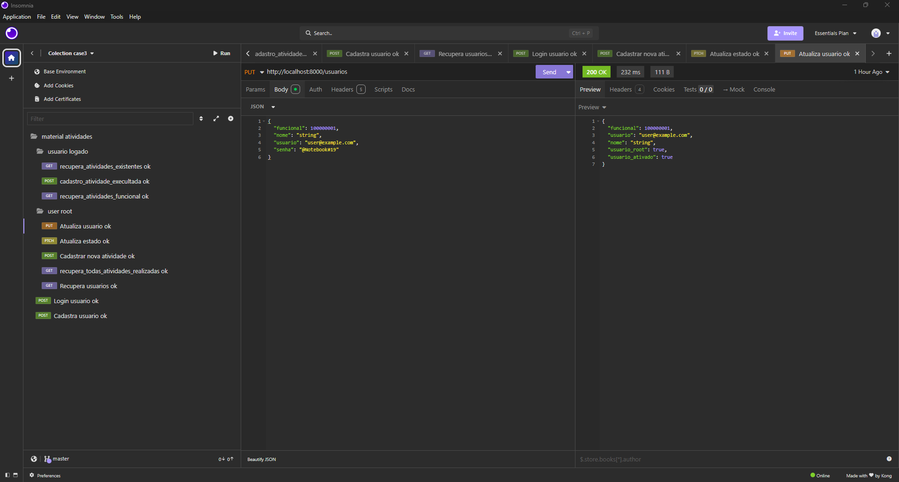

### Resposta da IA
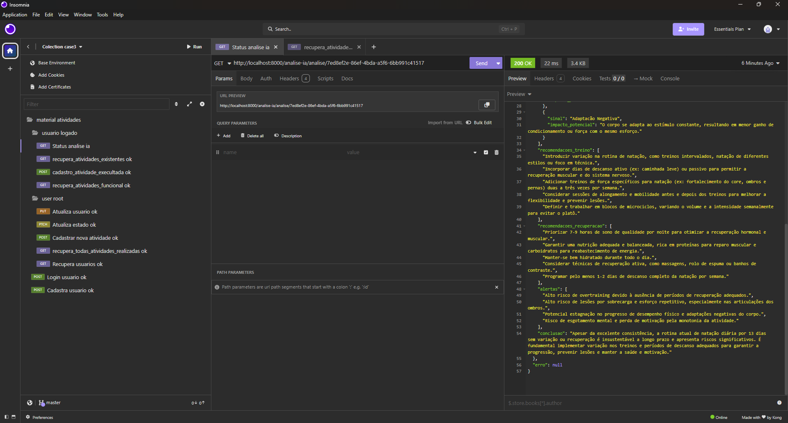


---

# 🚧 Melhorias Futuras

- cada usuário poder ter a sua prorpia lista de exercícios fisicos
- construção do frontend
- cache com Redis
- containerização com Docker
- CI/CD com GitHub Actions
- deploy na AWS

---

# 🔮 Pontos de Observação

- o usuario poderia vir ser criado apartir do consumo de APIs de emails reais como hotmail e gmail
- poderiamos aplicar sistemas de observabilidade com datadog para termos uma noção exata do que esta acontecendo afim de se ter um ponto factual e termos um acompanhamento de maior proximidade com os nossos usuarios
- no cadastro da atividade se pensarmos em um contexto geral a funcional poderia vir possuir numeros e letras, todavia no caso do case a unica verificação colocada foi garantir que a mesma fosse devidamente preenchida com validação de uma regex sndo composto por intermedio de 9 números

---